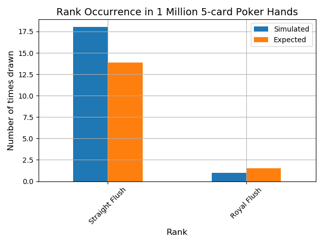
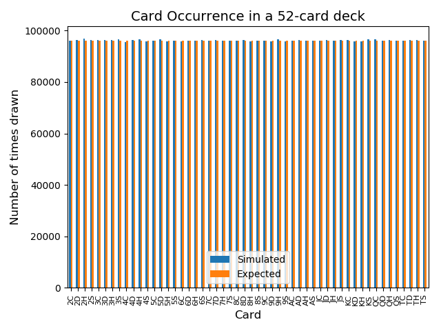
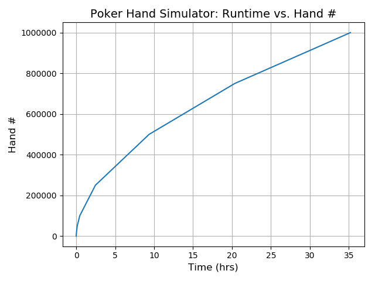

# Python Final Project-Samuel J. Magaziner

### Background
##### An often discussed element of computer science is the nature of programmed randomness.  What is "true" randomness?  Are there innate biases constructed when designing inherently ordered algorithms to mimic random events?  This project was developed to perhaps scratch at the surface of these questions.
##### I am fan of poker and card games in general.  A standard deck of cards contains 52 unique cards spread across 13 ranks (A, K, Q, J, 10, 9, 8, 7, 6, 5, 4, 3, 2) each in 4 suits (Spades, Hearts, Diamonds, and Clubs).  Were one to draw 5-cards from the top of a standard deck there are 2,598,960 possible combinations.  As playing cards are in essence a visual representation of statistics and randomness at play, I settled on developing a project focused on poker hand simulation, classification, analysis, and visualization.  
##### As we can statistically model the theoretical outcomes of any number 5-card poker hands (rank occurrence, card occurrence, etc.), this software was used to simulate 1 million 5-card hands, comparing them to the expected outcomes and graphing the results.
##### In addition, looking at text versions of poker hands is fairly unsatisfying.  Thus a large (probably too large) endeavor of this project was to build a hand visualizer, an ability to generate real time images of the hands being simulated within the console.  This was successful.

### Elements Built and Repo Organization
#### The most important file is 'Putting_it_all_together-Poker_Hand_Sim_and_Visualizer.py' as this combines every single element described below.  However this repository contains several .py files, pulled apart so as to more easily access, analyze, and reuse any code of interest pertaining to each aspect of this project.
#### 1) Imports.py
##### This contains all the required packages and imports
#### 2) Global_variables.py
##### This script contains the lists and dictionaries used to build a standard 52-card deck.
#### 3) Functions.py
##### Possesses the definitions for several key functions including those for a) drawing a random 5-card hand, b) sorting and calling a given hands hand values (hv) and hand suit values (hs), c) a function for defining a given 5-card poker hands rank (pair, flush, etc.), and d) the function to generate an image/visual representation of the hand drawn.
#### 4) Main_program.py
##### Possesses the primary program which utilizes the previous described function.  This main program iteratively generates random hands, ranks them, sorts them, marks the hand-draw time, stores them within a dataframe to be saved to an excel sheet, and, if prompted, generates an image of each hand drawn.
#### 5) Graphing_functions.py
##### Utilizes the data employed to generate figures based on simulated hand data
#### 6) Data
##### Acts as the storage point for expected hand outcome information, contains data on 1 million poker hands simulated by this program, and is the storage point for any newly recorded hand data.
#### 7) Deck_of_cards_with_parentheses
##### Storage point for .png image files of cards
#### 8) Figures
##### Storage point for figures generated in this study (and for any future figures generated with this code)
#### 9) Putting_it_all_together-Poker_Hand_Sim_and_Visualizer.py
##### Combines all of the above elements into one comprehensive script

### Putting it together-Results
##### As can be seen from the below figures, this hand simulator generates outcomes well within the expected margins.  
##### 
.png)

"

