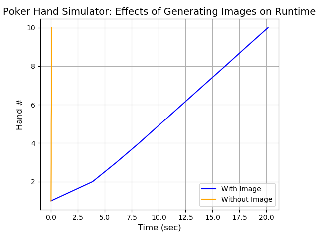

# Python Final Project-Samuel J. Magaziner
## 5-Card Poker Hand Simulator and Visualizer

### Background
##### An often discussed element of computer science is the nature of programmed randomness.  What is "true" randomness?  Are there innate biases constructed when designing inherently ordered algorithms to mimic random events?  This project was developed to perhaps scratch at the surface of these questions.
##### I am fan of poker and card games in general.  A standard deck of cards contains 52 unique cards spread across 13 ranks (A, K, Q, J, 10, 9, 8, 7, 6, 5, 4, 3, 2) each in 4 suits (Spades, Hearts, Diamonds, and Clubs).  Were one to draw 5-cards from the top of a standard deck there are 2,598,960 possible combinations.  As playing cards are in essence a visual representation of statistics and randomness at play, I settled on developing a project focused on poker hand simulation, classification, analysis, and visualization.  
##### As we can statistically model the theoretical outcomes of any number 5-card poker hands (rank occurrence, card occurrence, etc.), this software was used to simulate 1 million 5-card hands, comparing them to the expected outcomes and graphing the results.
##### In addition, looking at text versions of poker hands is fairly unsatisfying.  Thus a large (probably too large) endeavor of this project was to build a hand visualizer, an ability to generate real time images of the hands being simulated within the console.  This was successful (an example is below).

##### Below are the main arguments that must be provided within the code: how_many_hands (currently set to 5) and if you wish poker hand images to appear for each hand (currently set to True). 
    #%% MAIN PROGRAM: Auto hand-drawer, visualizer, and data compiler

    # Enter the number of hands you desire to generate
    how_many_hands = 5

    # Do you want images to appear for each hand (if yes, input 1 or True, if no input 0 or False)?
    # TOO MANY HAND IMAGES BEING GENERATED WILL SLOW DOWN YOUR COMPUTER GREATLY
    make_images_appear = True
    
### Elements Built and Repo Organization
#### The most important file is 'Putting_it_all_together-Poker_Hand_Sim_and_Visualizer.py' as this combines every single element described below.  However this repository contains several .py files, pulled apart so as to more easily access, analyze, and reuse any code of interest pertaining to each aspect of this project.
#### 1) Program_components/Imports.py
##### This contains all the required packages and imports
#### 2) Program_components/Global_variables.py
##### This script contains the lists and dictionaries used to build a standard 52-card deck.
    
    # 'C' are clubs, 'D' are diamonds, 'H' are hearts, 'S' are spades
    Suit_list = ['C', 'D', 'H', 'S']
    # Numeric corresponds to rank with 'T' for 10, 'J' for Jack, 'Q' for Queen, 'K' for King, and 'A' for Ace
    Value_list = ['2', '3', '4', '5', '6', '7', '8', '9', 'T', 'J', 'Q', 'K', 'A']
    
    # Making a deck using lists instead of new class functions
    deck2 = [[v + s] for s in Suit_list for v in Value_list]
    
    # These dictionaries are used to pull from the card call the values of each assigned and suit for use in hand determination
    rank_dictionary = {
            '2': 1,
            '3': 2,
            '4': 3,
            '5': 4,
            '6': 5,
            '7': 6,
            '8': 7,
            '9': 8,
            'T': 9,
            'J': 10,
            'Q': 11,
            'K': 12,
            'A': 13
            }
    suit_dictionary = {
            'S': 4,
            'H': 3,
            'D': 2,
            'C': 1
            }
            
#### 3) Program_components/Functions.py
##### Possesses the definitions for several key functions including those for a) drawing a random 5-card hand, b) sorting and calling a given hands hand values (hv) and hand suit values (hs), c) a function for defining a given 5-card poker hands rank (pair, flush, etc.), and d) the function to generate an image/visual representation of the hand drawn.

##### Example below: Function for defining hand rank
    def what_is_the_hand_rank():
        '''Defines hand ranks; the len(set(hs)) and len(set(hv)) functions look for unique values in the hv or hs lists
        E.g. A flush (all same suit) possesses only one unique suit value, thus len(set(hs)) == 1
            Since ranks are numbered, other relations appear such as straights always possessing a range of 4
        Exceptions exist and are noted/coded as appropriate
            E.g. a hand of len(set(hv)) == 2 can be either [A,A,A,K,K] or [A,A,A,A,K]
                These hands can be further differentiated by whether the 1st and 4th or 2nd and 5th cards have == values
                If they do, they must be four of a kind, if not, they must be full houses
        The default rank is a high card; Elif statements alter this variable if the proper conditions are met'''
        hand_rank = "High Card"
        if len(set(hs)) == 1 and hv == [13, 12, 11, 10, 9]:
            hand_rank = 'Royal Flush'
        elif len(set(hs)) == 1 and (hv[0] == hv[4] + 4 or hv == [13, 4, 3, 2, 1]):
            hand_rank = 'Straight Flush'
        elif len(set(hv)) == 2 and (hv[0] == hv[3] or hv[1] == hv[4]):
            hand_rank = 'Four of a Kind'
        elif len(set(hv)) == 2:
            hand_rank = 'Full House'
        elif len(set(hs)) == 1:
            hand_rank = 'Flush'
        elif (hv[0] == hv[4] + 4 and len(set(hv)) == 5) or hv == [13, 4, 3, 2, 1]:
            hand_rank = 'Straight'
        elif len(set(hv)) == 3 and (hv[0] == hv[2] or hv[2] == hv[4]):
            hand_rank = 'Three of a Kind'
        elif len(set(hv)) == 3:
            hand_rank = 'Two Pair'
        elif len(set(hv)) == 4:
            hand_rank = 'Pair'
        return hand_rank
        
#### 4) Program_components/Main_program.py
##### Possesses the primary program which utilizes the previous described function.  This main program iteratively generates random hands, ranks them, sorts them, marks the hand-draw time, stores them within a dataframe to be saved to an excel sheet, and, if prompted, generates an image of each hand drawn.
##### Below is the main program

    #%% MAIN PROGRAM: Auto hand-drawer, visualizer, and data compiler
    
    # Enter the number of hands you desire to generate
    how_many_hands = 5
    
    # Do you want images to appear for each hand (if yes, input 1, if false input 0?
    #### TOO MANY HAND IMAGES BEING GENERATED WILL SLOW DOWN YOUR COMPUTER GREATLY
    make_images_appear = True
    
    # Generates empty pandas dataframe onto which we will append info from each hand
    poker_hands_df = pd.DataFrame()
    
    # Hand counter
    hand_counter = 0
    
    # Current time:
    StartTime = datetime.datetime.now()
    
    for i in range(how_many_hands):
        # Notifies which hand the player is currently on
        hand_counter = hand_counter + 1
        print('This is hand #' + str(hand_counter))
    
        # This draws one's unique 5-card hand and sorts it, grouping like cards
        random_hand = draw_a_hand()
        sorted_hand = sorted(random_hand)
        print(sorted_hand)
    
        # Pulls hand values and suits for use in rank checking, see function documentation for detailed explanation
        hs = check_hand_values_and_suits()[0]
        hv = check_hand_values_and_suits()[1]
    
        # Defines hand ranks; see function documentation for detailed explanation
        hand_rank = what_is_the_hand_rank()
        print(hand_rank)
    
        # Creates a time stamp for each hand iteration
        current_time = datetime.datetime.now()
        time_diff = current_time - StartTime
        print(time_diff)
    
        # This generates a pandas dataframe for the most recent hand drawn
        add_hand = pd.DataFrame({'Hand Rank': hand_rank,
                                 'Card 1': sorted_hand[0],
                                 'Card 2': sorted_hand[1],
                                 'Card 3': sorted_hand[2],
                                 'Card 4': sorted_hand[3],
                                 'Card 5': sorted_hand[4],
                                 'Time to completion': str(time_diff)})
    
        # This will append the most recently drawn hand to the empty/existing pandas dataframe
        poker_hands_df = poker_hands_df.append(add_hand)
    
        # This argument will return an image for each hand drawn (if noted by player)
        # It can be used to stitch any images together, just change pathways and names of the function
        # See function documentation for more information
        if make_images_appear == 1:
            make_poker_hand_images()

    # Lastly, this will store the dataframe as an excel sheet entitled 'Poker Statistics'
    # While the variable poker_hands_df will be the appropriate, complete dataframe, this ensures the data is saved
    if how_many_hands == hand_counter:
        with pd.ExcelWriter('Data/Poker Hand Statistics.xlsx') as writer:
            poker_hands_df.to_excel(writer, sheet_name='Sheet1')
        print(poker_hands_df)

#### 5) Program_components/Graphing_functions.py
##### Utilizes the data employed to generate figures based on simulated hand data
#### 6) Data
##### Acts as the storage point for expected hand outcome information, contains data on 1 million poker hands simulated by this program, and is the storage point for any newly recorded hand data.
#### 7) Deck_of_cards_with_parentheses
##### Storage point for .png image files of cards
#### 8) Figures
##### Storage point for figures generated in this study (and for any future figures generated with this code)
#### 9) Putting_it_all_together-Poker_Hand_Sim_and_Visualizer.py
##### Combines all of the above elements into one comprehensive script.

### Putting it together-Results
##### As can be seen from the below figures, this hand simulator generates outcomes well within the expected margins.  
##### 
.png)

.png)

.png)

